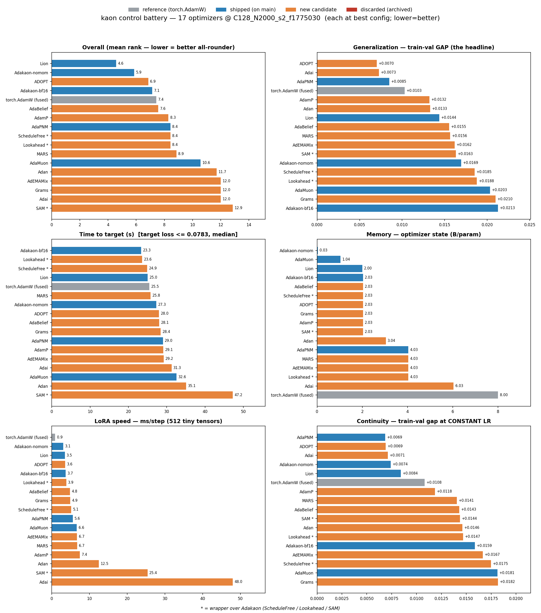
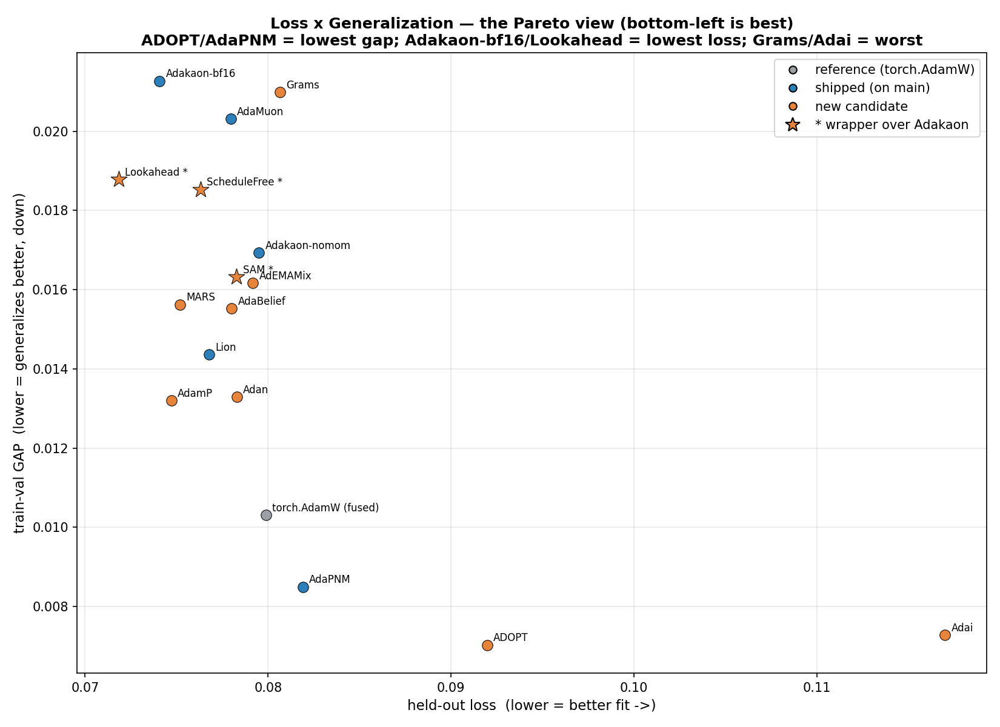

# Benchmarks

```
benchmarks/
├── proxy/                  # shared, optimizer-AGNOSTIC proxy (used by everything)
│   ├── dataset.py          #   the registered deterministic synthetic dataset (train=32/test=96)
│   └── harness.py          #   pixel-DDPM U-Net + DDPM loss + the LoRA-like adapter-bag speed probe
├── control/                # the cross-optimizer CONTROL BATTERY  ← start here
│   ├── registry.py         #   every optimizer + its best config (+ optional `variants` to probe)
│   ├── battery.py          #   RANKS the field: measure → cache → regenerate RANKINGS.md
│   ├── results.json        #   the per-optimizer ranking cache (git-tracked, reproducible)
│   ├── results_archive.json#   discarded optimizers' cached numbers (kept after they leave the registry)
│   ├── RANKINGS.md         #   the generated ranked tables  ← read here
│   ├── plot_rankings.py    #   renders the cache as charts -> plots/{dashboard,loss_vs_gap}.png
│   ├── plots/*.png         #   the generated charts (see "At a glance" below)
│   ├── perceptual_eval.py  #   samples each model + scores sample quality (FID/KID-style proxy)
│   ├── PERCEPTUAL.md        #   the perceptual-proxy write-up + verdict
│   ├── profiler.py         #   PROFILES one optimizer: "what does it like?" (LR/sched/warmup/…)
│   └── profiles/<Name>.md  #   the generated per-optimizer profile
└── adamuon/                # optimizer-specific deep-dives (historical campaign)
    ├── pixel_ddpm_ab.py     #   AdaMuon-vs-Adakaon convergence A/B (CLI, presets)
    ├── sdxl_lora_ab.py      #   real SDXL LoRA A/B (adamw_fused / adafactor arms)
    └── RESULTS_*.md         #   the AdaMuon campaign write-ups
```

## The control battery

One reproducible suite that scores **every** optimizer at its best config across the dimensions
we actually care about, and emits easy-to-read **rankings** ([`control/RANKINGS.md`](control/RANKINGS.md)):

| dimension | what it measures |
|---|---|
| ⚡ per-iteration speed | `ms/step` on the C=128 U-Net (full-FT-like) **and** on a 512-tiny-tensor adapter bag (LoRA-like, launch-bound — where `foreach` pays off) |
| ⏱️ convergence speed | steps to reach a common held-out quality target |
| ⏱️ time × quality | wall-clock to that target = ms/step × steps |
| 🎯 loss × generalization | final held-out loss **and the train–val gap** (the real objective for small-data fine-tuning) |
| 💾 memory | measured optimizer-state bytes/param |
| 🔁 continuity | the train–val gap at **constant LR** (no schedule → resumable) and its change vs the scheduled gap |

Everything runs on the reproducible multi-resolution proxy (`512/768/1024` ≙ `32²/48²/64²`) with
the REX d=0.9 + progressive-resolution recipe — the same setup that stands in for a full
fine-tune (wide U-Net) and a LoRA (the adapter bag).

## At a glance — the charts

[`plot_rankings.py`](control/plot_rankings.py) renders the cache (`results.json` + any archived
discards) as two figures. **Color = already-shipped (on main) / new-candidate / reference /
discarded; `*` (and the ★ in the scatter) = a wrapper that runs over Adakaon as its base
(ScheduleFree / Lookahead / SAM). Lower is better everywhere.**

```bash
python benchmarks/control/plot_rankings.py     # re-renders instantly from the cache (no retraining)
```

### The 6 dimensions at once


### Loss × Generalization — the Pareto view (what wins regardless of cost)
The headline for small-data fine-tuning: **bottom-left is best** (low loss *and* low gap). It shows
*who's good at any price* — read it together with the dashboard's memory/speed panels, because a
point that looks great here can still be heavy or slow (e.g. Adan sits in the good region but is the
2nd-heaviest and 2nd-slowest; the scatter alone hides that).



> Discarded optimizers keep their measured numbers in
> [`results_archive.json`](control/results_archive.json) (a separate cache) so these charts and this
> README preserve the full historical comparison even after a contender leaves the live `registry.py`.

### Run it

```bash
python benchmarks/control/battery.py            # measure every registry optimizer, refresh rankings
python benchmarks/control/battery.py --new      # measure only optimizers missing from the cache
python benchmarks/control/battery.py --render-only   # rebuild RANKINGS.md from the cache (no training)
python benchmarks/control/battery.py --quick    # smaller/faster settings (smoke; separate cache)
```

### Add a contender (the whole point)

1. Add one entry to [`control/registry.py`](control/registry.py) — its best config + the LR it
   wants at the proxy scale.
2. Run **just it**:
   ```bash
   python benchmarks/control/battery.py --only YourOptimizer
   ```
   Its data is measured, merged into `results.json`, and **every ranking is regenerated against
   the whole field** — you never re-measure the others.

Only entries measured at the *same* settings signature (`C`/`N`/seeds/dataset-fingerprint) are
ranked together; the battery flags any stale entries to re-run.

## The profiler — "what does this optimizer like?"

The battery ranks each optimizer at **one** best config. The **profiler**
([`control/profiler.py`](control/profiler.py)) does the opposite: it explores configs for **one**
optimizer to discover its preferences — the diagnostic probes you always run on a new contender
but that aren't part of the ranking. By greedy coordinate search (each step fixes the previous
winner, ranked by **held-out loss**, with the gap shown as the overfit diagnostic):

1. **ideal LR** — sweep around the registry LR (loss-best vs gap-best may differ).
2. **schedule** — constant vs REX vs cosine vs linear: which decay does it want? (does it live on a constant LR?)
3. **warmup** — none / short / longer: does it help?
4. **curriculum** — single-resolution vs progressive: how much data-noise regularization it leans on.
5. **knobs** — any optimizer-specific constructor variations declared in the registry's optional
   `variants` field (e.g. AdaPNM's `cautious` on/off, `beta0`).

```bash
python benchmarks/control/profiler.py --opt AdaPNM     # -> profiles/AdaPNM.md
```

To probe an optimizer's own knobs, add a `variants={label: make, …}` dict to its `registry.py`
entry (see AdaPNM for the pattern); the profiler A/Bs them automatically.

## Caveats (read before trusting a ranking)

- **Proxy LRs are ~100× real-training LRs.** They are relative knobs for the synthetic benchmark,
  not recommendations for your data — always re-tune `lr` on a real run.
- The metrics rank **objective overfitting / convergence**, not **perceptual fidelity**. The proxy
  once ranked a Muon-style optimizer above the real visual-A/B winner. Treat the rankings as a
  strong signal and a regression guard, **not** a settled verdict — confirm on a real LoRA with
  FID/KID + a live `val/gap` metric.
- GPU non-determinism (cudnn) is ~0.001 on these losses; differences below that are noise.
